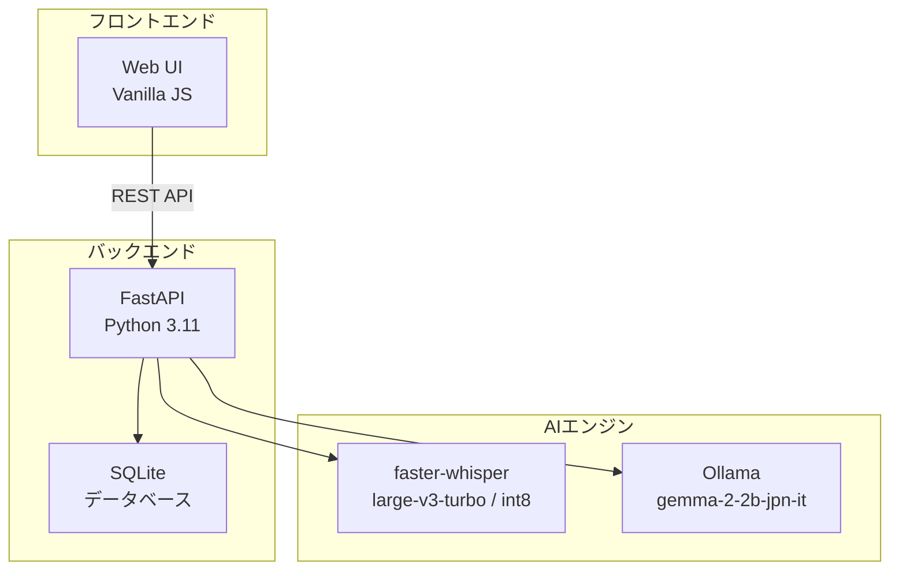

# LocalAI-WhisperSummarizer

音声ファイルからテキスト転写とAI要約を生成する、会議議事録作成に特化したWebアプリケーション

## 📋 概要

本システムは、M4A形式の音声ファイルをアップロードし、`faster-whisper` と `Ollama` を使用して高精度なテキスト転写とAI要約を自動生成するツールです。会議の議事録作成を効率化することに特化しており、簡単な操作で構造化された要約（Markdown形式）を取得できます。完全にローカルAIで完結するため、機密性の高い会議でも安心して利用可能です。

**特徴的な処理フロー**: 音声書き起こし（Whisper） → AI文脈補正（Ollama） → AI要約（Ollama）の3段階パイプラインにより、日本語の特性に合わせた高精度な出力を実現します。

## ✨ 主要機能

- **会議議事録特化型UI**:
  - 複雑な設定を排除し、ファイルをアップロードするだけで処理を開始可能
  - 会議の内容に最適化されたAI要約プロンプトを採用
- **3段階AI処理パイプライン**:
  1. **音声書き起こし**: `faster-whisper` (`large-v3-turbo`) による高速・高精度な音声認識（CPU最適化済み）
  2. **AI文脈補正**: `Ollama` (`gemma-2-2b-jpn-it`) による誤字脱字・不自然な表現の自動修正
  3. **AI要約生成**: 標準的な議事録フォーマット（概要、議題、決定事項、ToDo、次回会議）での構造化
- **UI/UXの最適化**:
  - **ワンクリックコピー**: 結果エリアに配置されたコピーアイコンから、即座に議事録をクリップボードへ保存
  - **リアルタイム進捗**: 0%から100%まで、処理の各段階（書き起こし・補正・要約）を視覚的に表示
- **広範なファイル対応**: M4A/MP4/WAV/MP3形式（最大50MB）、MIMEタイプの自動正規化機能
- **技術スタック**: FastAPI (Python 3.11), Vanilla JS, SQLite, faster-whisper, Ollama

## 🏗️ システム構成



## 🚀 クイックスタート (Nix / UV 環境)

### 前提条件
- Nix Package Manager
- Ollama (gemma-2-2b-jpn-it モデル)

### 起動手順

```bash
# プロジェクトディレクトリへ移動
cd LocalAI-WhisperSummarizer

# Nix開発環境の有効化
nix --extra-experimental-features 'nix-command flakes' develop

# 依存関係の同期
uv sync

# データベースを再初期化
rm data/LocalAI-WhisperSummarizer.db*
python scripts/init_db.py

# Ollama サービスの起動（別のターミナルで実行推奨）
ollama serve

# 開発サーバーの起動
python -m uvicorn app.main:app --reload --host 0.0.0.0 --port 8100
```

アプリケーションURL: `http://localhost:8100`

## 📊 AI処理詳細

### 処理パイプラインと進捗
1. **音声書き起こし (10% - 50%)**: `faster-whisper` を使用。OpenAI Whisperより4-8倍高速化(CPU環境)
2. **AI文脈補正 (50% - 70%)**: 日本語特化モデルによるテキストのクリーンアップ
3. **AI要約生成 (70% - 100%)**: 補正済みテキストから標準Markdown形式の議事録を生成

### 議事録フォーマット
要約結果は以下の構成で出力されます：
- `# 要約` (H1)
- `## 議題・議論内容` (H2)
- `## 決定事項` (H2)
- `## ToDo` (H2)
- `## 次回会議` (H2)

## 📁 主要ディレクトリ構造

- `app/`: バックエンドAPI (FastAPI)
- `static/`: フロントエンド (HTML/CSS/JS)
- `scripts/`: 初期化・検証用スクリプト
- `tests/`: pytestによるテストスイート (現在 19/19 テスト通過中)
- `data/`: SQLiteデータベース保存先

## 📄 ライセンス

MIT License

---
📝 **最新の更新 (v24.12)**: 会議議事録への特化、UIの簡素化（用途選択の自動化）、コピー機能の強化、および `faster-whisper` による推論速度の大幅な向上を達成しました。