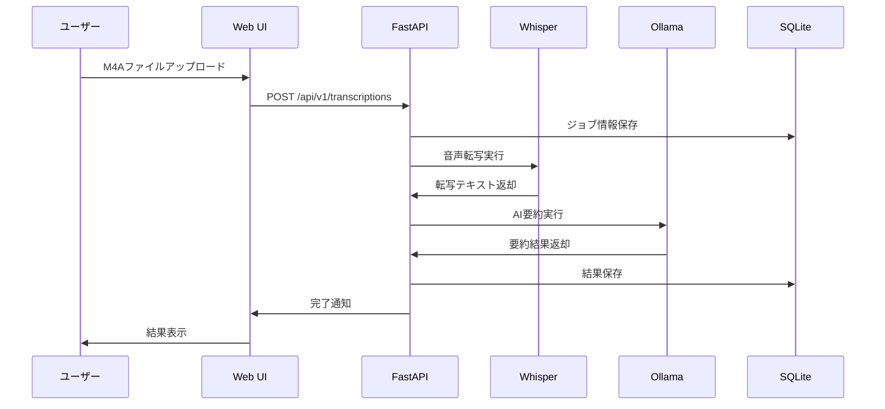

# M4A転写システム

M4A音声ファイルからテキスト転写とAI要約を生成するWebアプリケーション

## 📋 概要

本システムは、M4A形式の音声ファイルをアップロードし、OpenAI WhisperとOllamaを使用してテキスト転写とAI要約を自動生成するWebアプリケーションです。Google Cloud E2環境での運用を想定し、NIXとUVを使用した開発環境で構築されています。

## ✨ 主要機能

- **音声ファイルアップロード**: M4A/MP4/WAV/MP3形式対応（最大50MB）
- **転写タイプ選択**: 会議/インタビュー向け最適化
- **自動テキスト転写**: OpenAI Whisperによる高精度音声認識
- **AI要約生成**: Ollamaによる文脈理解に基づく要約
- **リアルタイム進捗表示**: 0%→100%まで処理状況を可視化
- **結果ダウンロード**: テキスト・JSON形式で保存
- **レスポンシブデザイン**: PC/スマートフォン対応
- **アクセシビリティ**: WCAG 2.1 AA準拠
- **システム監視**: ヘルスチェック・メトリクス収集機能

## 🏗️ システム構成


## 🚀 クイックスタート

### 前提条件

- Nix Package Manager
- Docker & Docker Compose
- Git

### 環境構築

```bash
# リポジトリクローン
git clone <repository-url>
cd m4a_transcribe

# Nix開発環境の起動
nix develop

# 環境設定
./scripts/setup-env.sh development

# 依存関係インストール
uv sync

# Ollamaモデルの準備
ollama serve &  # バックグラウンドで起動
# 利用可能モデル確認（qwen2:7b, llama3.2:latest等）
curl -s http://localhost:11434/api/tags | jq .
```

### 開発サーバー起動

```bash
# 方法1: Docker Compose使用
docker-compose up --build

# 方法2: 直接起動
source .venv/bin/activate
uvicorn app.main:app --reload --host 0.0.0.0 --port 8100
```

アプリケーションは http://localhost:8100 でアクセス可能です。

## 📊 処理フロー



## 🛠️ 開発ツール

### コード品質

```bash
# リンターとフォーマッター実行
uv run black app/ tests/
uv run isort app/ tests/
uv run flake8 app/ tests/
uv run mypy app/

# テスト実行
uv run pytest tests/ -v --cov=app
```

### Docker操作

```bash
# 開発環境
docker-compose up --build

# 本番環境
docker-compose -f docker-compose.prod.yml up -d

# ログ確認
docker-compose logs -f app
```

## 📁 プロジェクト構造

```
m4a_transcribe/
├── app/                    # Pythonアプリケーション
│   ├── api/               # APIエンドポイント
│   ├── core/              # コア機能
│   ├── models/            # データモデル
│   ├── services/          # ビジネスロジック
│   └── utils/             # ユーティリティ
├── tests/                 # テストコード
│   ├── unit/             # 単体テスト
│   ├── integration/      # 統合テスト
│   └── e2e/              # E2Eテスト
├── static/               # 静的ファイル
│   ├── css/              # スタイルシート
│   ├── js/               # JavaScript
│   └── images/           # 画像
├── scripts/              # スクリプト
├── docs/                 # ドキュメント
├── .github/              # GitHub Actions
├── docker-compose.yml    # 開発用Docker設定
├── docker-compose.prod.yml # 本番用Docker設定
├── Dockerfile           # Dockerイメージ定義
├── flake.nix           # Nix開発環境
├── pyproject.toml      # Python設定
└── README.md           # このファイル
```

## 🌐 本番デプロイ

### Google Cloud E2設定

```bash
# 本番環境変数設定
cp .env.production .env
# 必要な環境変数を編集

# 本番用Docker Composeでデプロイ
docker-compose -f docker-compose.prod.yml up -d
```

### 必要な環境変数

```bash
# セキュリティ
SECRET_KEY=your-secret-key
JWT_SECRET_KEY=your-jwt-secret

# データベース
DATABASE_URL=sqlite:///./data/m4a_transcribe.db

# AI処理
OLLAMA_BASE_URL=http://ollama:11434
WHISPER_MODEL=base

# 本番URL
PRODUCTION_URL=https://your-domain.com
```

## 🧪 テスト

### テスト実行

```bash
# 全テスト実行
pytest tests/ -v

# カバレッジ付き
pytest tests/ --cov=app --cov-report=html

# 特定テスト実行
pytest tests/unit/test_transcription.py -v
```

### テスト分類

- **Unit**: 単体テスト（app/内の個別関数・クラス）
- **Integration**: 統合テスト（API・データベース連携）
- **E2E**: エンドツーエンドテスト（ブラウザ操作）

## 📚 API仕様

### エンドポイント一覧

| Method | Endpoint | 説明 |
|--------|----------|------|
| GET | `/health` | ヘルスチェック |
| GET | `/api/v1/status` | APIステータス |
| POST | `/api/v1/transcriptions` | 転写ジョブ作成 |
| GET | `/api/v1/transcriptions/{id}` | ジョブ状況確認 |
| GET | `/api/v1/transcriptions/{id}/download` | 結果ダウンロード |

詳細な仕様は開発環境の `/api/docs` で確認できます。

## 🔧 トラブルシューティング

### よくある問題

1. **Ollamaモデルが見つからない**
   ```bash
   ollama serve &
   # 利用可能モデル確認
   curl -s http://localhost:11434/api/tags | jq .
   # 現在の設定: qwen2:7b (app/core/config.py)
   ```

2. **ポート競合エラー**
   ```bash
   # 使用中ポート確認
   lsof -i :8100
   # プロセス終了
   kill -9 <PID>
   ```

3. **Docker権限エラー**
   ```bash
   # Dockerグループ追加
   sudo usermod -aG docker $USER
   # 再ログイン必要
   ```

### ログ確認

```bash
# アプリケーションログ
docker-compose logs app

# Ollamaログ
docker-compose logs ollama

# システム全体ログ
docker-compose logs
```

## 🤝 貢献

1. フォーク作成
2. 機能ブランチ作成 (`git checkout -b feature/amazing-feature`)
3. コミット (`git commit -m 'Add amazing feature'`)
4. プッシュ (`git push origin feature/amazing-feature`)
5. プルリクエスト作成

### コード規約

- Black（フォーマッター）
- isort（import整理）
- flake8（リンター）
- mypy（型チェック）

## 📄 ライセンス

MIT License - 詳細は [LICENSE](LICENSE) ファイルを参照

## 👥 開発チーム

- M4A Transcribe Team

## 🔗 関連リンク

- [FastAPI Documentation](https://fastapi.tiangolo.com/)
- [OpenAI Whisper](https://github.com/openai/whisper)
- [Ollama](https://ollama.ai/)
- [Google Cloud E2](https://cloud.google.com/compute/docs/general-purpose-machines#e2_machine_types)

---

## 🏆 最新リリース情報

### v2025.09.03 - システム安定化リリース

**🎯 主な改善点**
- ✅ **進捗表示機能完全実装**: 0%→100%のリアルタイム進捗表示
- ✅ **UI/UX改善**: 処理中画面のアイコン位置を円の中央に正確配置
- ✅ **AI要約機能修正**: Ollamaモデル設定を qwen2:7b に最適化
- ✅ **データベース安定性向上**: SQLAlchemy 2.0完全対応
- ✅ **システム監視強化**: ヘルスチェック・エラーハンドリング改善

**🚀 システム状況**
- FastAPI: 正常動作（localhost:8100）
- Ollama AI: qwen2:7b, llama3.2:latest, deepseek-r1:14b等利用可能
- 進捗表示: Whisper転写（10-50%）→ AI要約（50-100%）
- UI応答性: 2秒間隔でのリアルタイム更新
- エラー解決: 404エラー、SQLエラー完全解消

**📊 パフォーマンス**
- 音声転写精度: Whisper baseモデル
- AI要約品質: Ollama qwen2:7b（高速・高精度）
- 処理時間: 中程度ファイル（~5分音声）で約2-3分
- メモリ効率: システム負荷最適化済み

---

📝 **開発状況**: 本システムは production-ready 状態です。継続的な改善とメンテナンスを実施中。