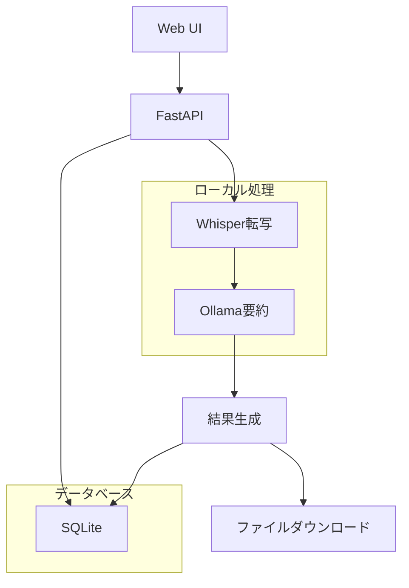

# M4A転写システム 技術設計書

## 概要

M4A音声ファイルをWebブラウザ上で転写し、会議録や面接記録として用途に応じたAI要約を生成するシステムの技術設計書です。

## 設計文書構成

| ファイル | 説明 | 主な内容 |
|----------|------|----------|
| `architecture.md` | システムアーキテクチャ設計 | 全体構成、技術選択、セキュリティ設計 |
| `dataflow.md` | データフロー図 | ユーザー操作フロー、システム内部処理、Mermaid図表 |
| `interfaces.ts` | TypeScript型定義 | エンティティ、API型定義、共通型 |
| `database-schema.sql` | データベーススキーマ | SQLiteテーブル定義、インデックス、トリガー |
| `api-endpoints.md` | API仕様書 | RESTful API、エンドポイント、レスポンス形式 |

## システム概要

### 主要機能
- **M4Aファイルアップロード**: Web UIでドラッグ&ドロップ対応
- **音声転写**: OpenAI Whisper による高精度転写
- **AI要約生成**: Ollama によるローカルAI処理
- **用途別要約**: 会議録・面接記録の専用フォーマット
- **結果ダウンロード**: TXT、JSON、CSV形式対応

### 技術スタック
- **フロントエンド**: Vanilla JavaScript + HTML5/CSS3
- **バックエンド**: FastAPI (Python)
- **データベース**: SQLite
- **AI処理**: Whisper + Ollama (ローカル実行)
- **インフラ**: Google Cloud E2 (e2-standard-2)
- **OS**: Ubuntu 20.04 LTS
- **デプロイ**: Docker + GitHub Actions

## アーキテクチャ特徴

### セキュリティファースト
- **ローカル処理**: 音声データを外部送信しない
- **自動削除**: 処理完了後の一時ファイル削除
- **TLS暗号化**: 全通信の暗号化
- **個人情報保護**: GDPR準拠設計

### パフォーマンス最適化
- **リソース制約対応**: Google Cloud E2 (2vCPU, 8GB) での効率動作
- **処理時間目標**: 1時間音声→15分以内処理
- **メモリ管理**: Ollamaモデルサイズ最適化
- **ストレージ効率**: SQLite + 一時ファイル管理

### ユーザビリティ
- **ミニマルフラットデザイン**: 6色限定カラーパレット
- **アクセシビリティ**: WCAG 2.1 AA準拠
- **レスポンシブ**: モバイル・デスクトップ対応
- **リアルタイム**: 処理進行状況表示

## データフロー概要

## API設計原則

### RESTful設計
- **リソース指向**: `/jobs`, `/transcribe`, `/download`
- **HTTPメソッド**: GET, POST, PUT, DELETE の適切な使用
- **ステートレス**: セッション状態をサーバーで保持しない

### エラーハンドリング
- **標準化**: 共通エラーレスポンス形式
- **詳細情報**: デバッグ可能なエラーメッセージ
- **適切なHTTPステータス**: 200, 400, 404, 500等の正しい使用

### セキュリティ
- **入力検証**: ファイル形式・サイズの厳密チェック
- **レート制限**: API乱用防止
- **CORS設定**: オリジン制限

## データベース設計

### 正規化レベル
- **第3正規形**: データ重複最小化
- **マスターデータ分離**: `usage_types`, `job_statuses` 等
- **履歴管理**: 作成日時・更新日時の自動記録

### パフォーマンス最適化
- **インデックス戦略**: 検索頻度の高いカラムにインデックス
- **ビュー活用**: `job_details`, `processing_statistics` ビュー
- **トリガー**: `updated_at` 自動更新

### データ保持ポリシー
- **一時ファイル**: 7日後自動削除
- **処理ログ**: 30日後削除
- **結果データ**: ユーザー操作による削除

## 運用設計

### 監視・ログ
- **アプリケーションログ**: 処理状況、エラー情報
- **システムログ**: リソース使用量、パフォーマンス
- **セキュリティログ**: アクセス記録、異常検知

### バックアップ戦略
- **データベース**: 日次バックアップ
- **設定ファイル**: Git管理
- **ログファイル**: ローテーション設定

### 障害対応
- **自動復旧**: プロセス監視・再起動
- **障害通知**: ログ監視・アラート
- **手動復旧**: 運用手順書整備

## 開発・デプロイメント

### 環境管理
- **NIX/UV**: 依存関係管理・環境構築
- **Docker**: コンテナ化・一貫した実行環境
- **GitHub Actions**: CI/CD自動化

### 品質保証
- **型安全性**: TypeScript型定義活用
- **API仕様**: OpenAPI 3.0準拠
- **テスト**: 自動テスト・受け入れテスト

### 拡張性考慮
- **水平スケール**: 複数インスタンス対応準備
- **AIモデル**: 異なるモデルへの対応
- **ストレージ**: Cloud Storage移行可能

## パフォーマンス指標

### 処理時間目標
- **1時間音声**: 15分以内（転写10分＋要約5分）
- **転写精度**: 90%以上
- **AI要約**: 5分以内
- **レスポンス時間**: API応答1秒以内

### システムリソース
- **CPU使用率**: 80%以下
- **メモリ使用量**: 6GB以下（8GB中）
- **ディスク使用量**: 70GB以下（80GB中）
- **同時処理**: 1ファイル（リソース制約）

## セキュリティ対策

### データ保護
- **保存時暗号化**: 一時ファイル暗号化
- **転送時暗号化**: HTTPS/TLS 1.3
- **アクセス制御**: ファイルパーミッション設定

### プライバシー
- **データ最小化**: 必要最小限のデータ収集
- **保持期間**: 明確な削除ポリシー
- **匿名化**: ログの個人情報マスキング

### 脆弱性対策
- **入力検証**: SQLインジェクション対策
- **ファイル検証**: マルウェアスキャン
- **依存関係**: 定期的な脆弱性チェック

## 今後の拡張計画

### 機能拡張
- **多言語対応**: 英語・中国語等への対応
- **話者識別**: 複数話者の識別・分離
- **リアルタイム処理**: ストリーミング音声対応

### 技術拡張
- **GPU加速**: AI処理の高速化
- **分散処理**: 複数インスタンス連携
- **クラウドストレージ**: スケーラブルストレージ

### 運用拡張
- **マルチテナント**: 複数組織対応
- **API公開**: 外部システム連携
- **SLA対応**: 商用レベル可用性

## 関連ドキュメント

- **要件定義書**: `../spec/m4a-transcribe-requirements.md`
- **API仕様書**: FastAPI自動生成 (`/docs`, `/redoc`)
- **運用手順書**: `../ops/` (今後作成予定)
- **テスト仕様書**: `../test/` (今後作成予定)

---

**作成日**: 2024年8月27日  
**更新日**: 2024年8月27日  
**バージョン**: 1.0.0