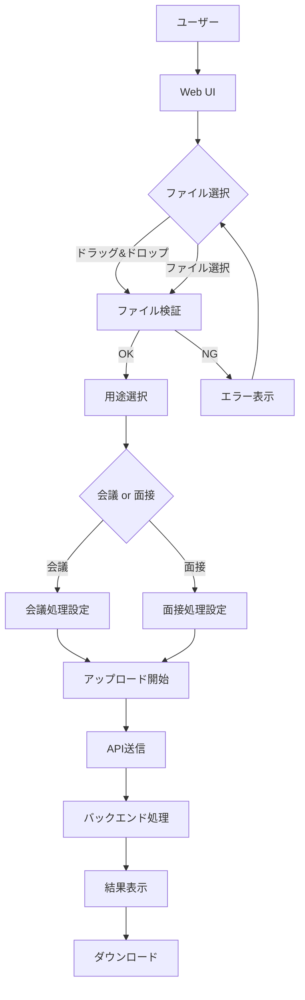
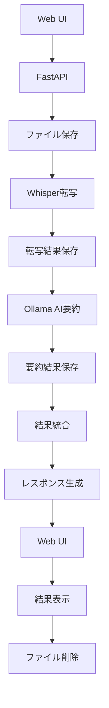
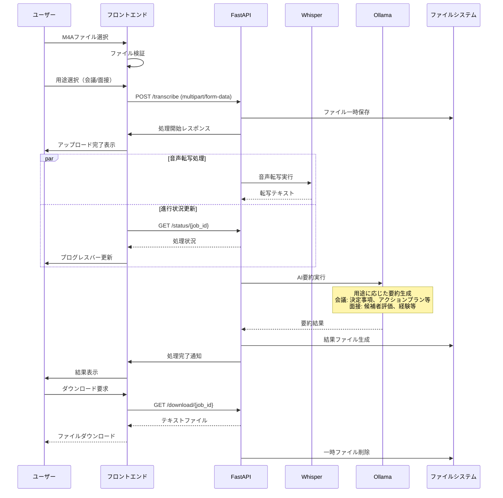
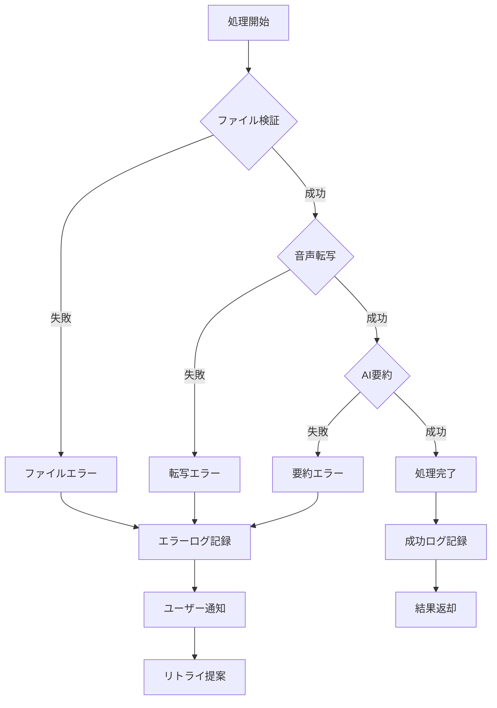
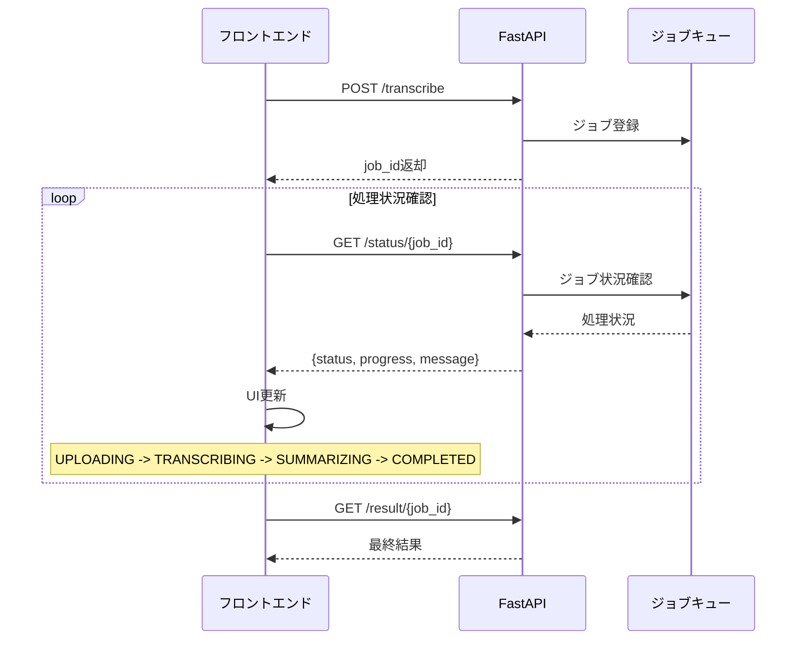
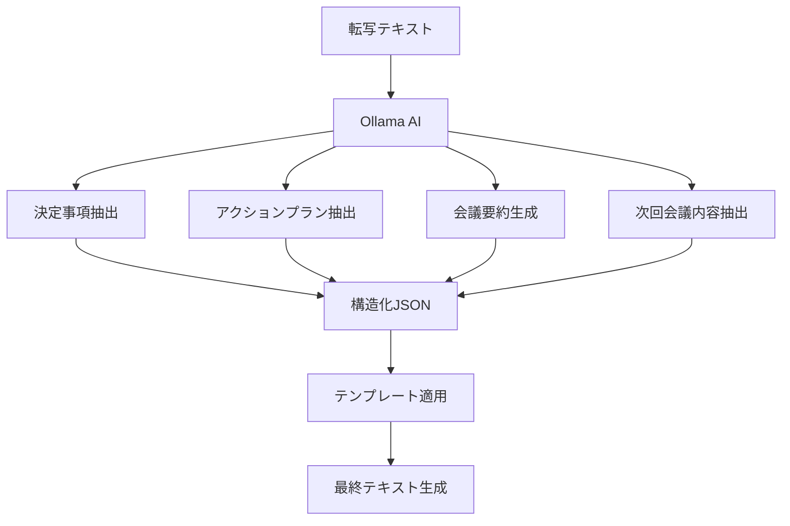
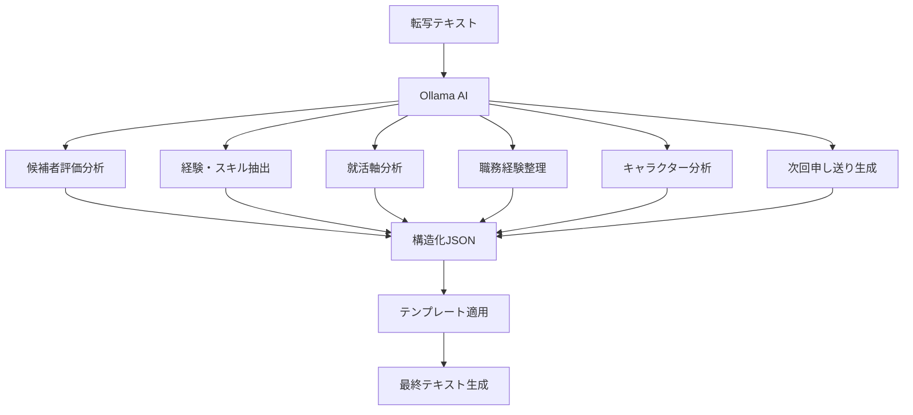
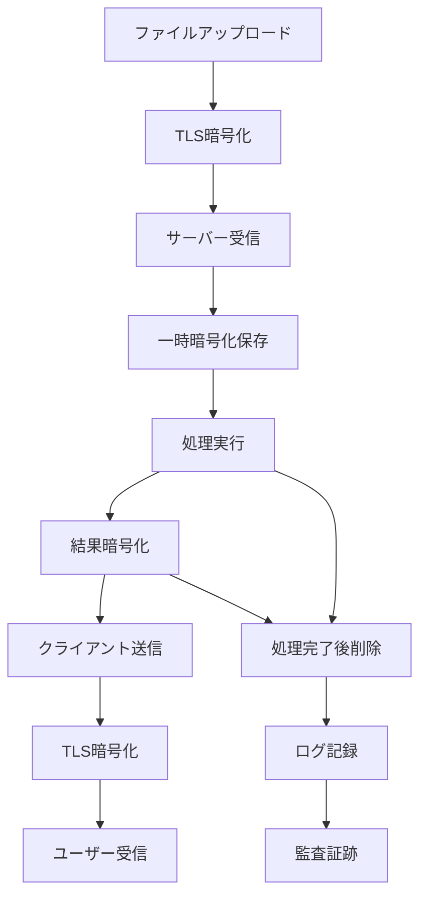

# データフロー図

## ユーザーインタラクションフロー

```mermaid
flowchart TD
    A[ユーザー] --> B[Web UI]
    B --> C{ファイル選択}
    C -->|ドラッグ&ドロップ| D[ファイル検証]
    C -->|ファイル選択| D
    D -->|OK| E[用途選択]
    D -->|NG| F[エラー表示]
    E --> G{会議 or 面接}
    G -->|会議| H[会議処理設定]
    G -->|面接| I[面接処理設定]
    H --> J[アップロード開始]
    I --> J
    J --> K[API送信]
    K --> L[バックエンド処理]
    L --> M[結果表示]
    M --> N[ダウンロード]
    F --> C
```

## システム内部データフロー

```mermaid
flowchart TD
    A[Web UI] --> B[FastAPI]
    B --> C[ファイル保存]
    C --> D[Whisper転写]
    D --> E[転写結果保存]
    E --> F[Ollama AI要約]
    F --> G[要約結果保存]
    G --> H[結果統合]
    H --> I[レスポンス生成]
    I --> J[Web UI]
    J --> K[結果表示]
    K --> L[ファイル削除]
```

## データ処理シーケンス

```mermaid
sequenceDiagram
    participant U as ユーザー
    participant F as フロントエンド
    participant API as FastAPI
    participant W as Whisper
    participant O as Ollama
    participant FS as ファイルシステム
    
    U->>F: M4Aファイル選択
    F->>F: ファイル検証
    U->>F: 用途選択（会議/面接）
    F->>API: POST /transcribe (multipart/form-data)
    
    API->>FS: ファイル一時保存
    API->>F: 処理開始レスポンス
    F->>U: アップロード完了表示
    
    par 音声転写処理
        API->>W: 音声転写実行
        W-->>API: 転写テキスト
    and 進行状況更新
        F->>API: GET /status/{job_id}
        API-->>F: 処理状況
        F->>U: プログレスバー更新
    end
    
    API->>O: AI要約実行
    note over O: 用途に応じた要約生成<br/>会議: 決定事項、アクションプラン等<br/>面接: 候補者評価、経験等
    O-->>API: 要約結果
    
    API->>FS: 結果ファイル生成
    API->>F: 処理完了通知
    F->>U: 結果表示
    
    U->>F: ダウンロード要求
    F->>API: GET /download/{job_id}
    API-->>F: テキストファイル
    F-->>U: ファイルダウンロード
    
    API->>FS: 一時ファイル削除
```

## エラーハンドリングフロー

```mermaid
flowchart TD
    A[処理開始] --> B{ファイル検証}
    B -->|失敗| C[ファイルエラー]
    B -->|成功| D{音声転写}
    D -->|失敗| E[転写エラー]
    D -->|成功| F{AI要約}
    F -->|失敗| G[要約エラー]
    F -->|成功| H[処理完了]
    
    C --> I[エラーログ記録]
    E --> I
    G --> I
    I --> J[ユーザー通知]
    J --> K[リトライ提案]
    
    H --> L[成功ログ記録]
    L --> M[結果返却]
```

## リアルタイム処理状況フロー

```mermaid
sequenceDiagram
    participant F as フロントエンド
    participant API as FastAPI
    participant Job as ジョブキュー
    
    F->>API: POST /transcribe
    API->>Job: ジョブ登録
    API-->>F: job_id返却
    
    loop 処理状況確認
        F->>API: GET /status/{job_id}
        API->>Job: ジョブ状況確認
        Job-->>API: 処理状況
        API-->>F: {status, progress, message}
        F->>F: UI更新
        note over F: UPLOADING -> TRANSCRIBING -> SUMMARIZING -> COMPLETED
    end
    
    F->>API: GET /result/{job_id}
    API-->>F: 最終結果
```

## データ変換フロー

```mermaid
flowchart LR
    A[M4A音声ファイル] --> B[Base64エンコード]
    B --> C[HTTP Transfer]
    C --> D[ファイル復元]
    D --> E[Whisper Input]
    E --> F[生テキスト]
    F --> G[テキスト前処理]
    G --> H[Ollama Input]
    H --> I[構造化要約]
    I --> J[JSON形式]
    J --> K[テキストファイル生成]
    K --> L[ダウンロード対応]
```

## 会議用要約データフロー

```mermaid
flowchart TD
    A[転写テキスト] --> B[Ollama AI]
    B --> C[決定事項抽出]
    B --> D[アクションプラン抽出]
    B --> E[会議要約生成]
    B --> F[次回会議内容抽出]
    
    C --> G[構造化JSON]
    D --> G
    E --> G
    F --> G
    
    G --> H[テンプレート適用]
    H --> I[最終テキスト生成]
```

## 面接用要約データフロー

```mermaid
flowchart TD
    A[転写テキスト] --> B[Ollama AI]
    B --> C[候補者評価分析]
    B --> D[経験・スキル抽出]
    B --> E[就活軸分析]
    B --> F[職務経験整理]
    B --> G[キャラクター分析]
    B --> H[次回申し送り生成]
    
    C --> I[構造化JSON]
    D --> I
    E --> I
    F --> I
    G --> I
    H --> I
    
    I --> J[テンプレート適用]
    J --> K[最終テキスト生成]
```

## セキュリティデータフロー

```mermaid
flowchart TD
    A[ファイルアップロード] --> B[TLS暗号化]
    B --> C[サーバー受信]
    C --> D[一時暗号化保存]
    D --> E[処理実行]
    E --> F[結果暗号化]
    F --> G[クライアント送信]
    G --> H[TLS暗号化]
    H --> I[ユーザー受信]
    
    E --> J[処理完了後削除]
    F --> J
    J --> K[ログ記録]
    K --> L[監査証跡]
```