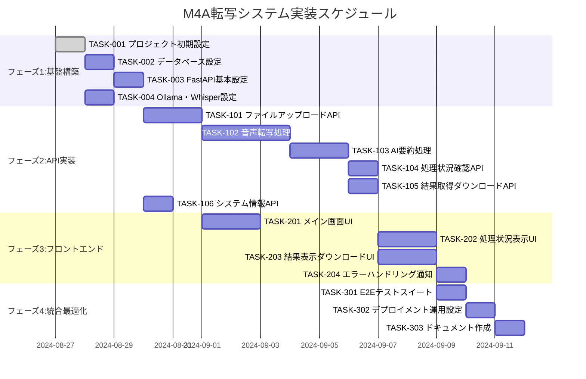

# M4A転写システム 実装タスク

## 概要

全タスク数: 26  
推定作業時間: 80時間  
クリティカルパス: TASK-001 → TASK-002 → TASK-003 → TASK-101 → TASK-102 → TASK-103 → TASK-201 → TASK-202 → TASK-203 → TASK-301

## タスク一覧

### フェーズ1: 基盤構築 (推定: 16時間)

#### TASK-001: プロジェクト初期設定・環境構築

- [ ] **タスク完了**
- **タスクタイプ**: DIRECT
- **要件リンク**: REQ-401, REQ-406, REQ-408
- **依存タスク**: なし
- **実装詳細**:
  - NIX/UV環境の設定 (flake.nix, pyproject.toml)
  - Docker Compose設定 (開発・本番環境)
  - GitHub Actions CI/CD設定
  - 環境変数管理 (.env, secrets)
  - プロジェクト構造作成
- **完了条件**:
  - [ ] nix run または uv run でアプリが起動する
  - [ ] Docker環境で正常動作する
  - [ ] GitHub Actions が動作する
  - [ ] 環境変数が適切に設定されている

#### TASK-002: データベース初期設定

- [ ] **タスク完了**
- **タスクタイプ**: DIRECT
- **要件リンク**: REQ-401, REQ-408
- **依存タスク**: TASK-001
- **実装詳細**:
  - SQLiteデータベース設定
  - database-schema.sql の実装
  - マイグレーション機能実装
  - 初期データ投入スクリプト
- **テスト要件**:
  - [ ] データベース接続テスト
  - [ ] スキーマ検証テスト
  - [ ] マイグレーション動作テスト
- **完了条件**:
  - [ ] データベースファイルが正常作成される
  - [ ] 全テーブルが定義通りに作成される
  - [ ] 初期データが投入される

#### TASK-003: FastAPIバックエンド基本設定

- [ ] **タスク完了**
- **タスクタイプ**: DIRECT
- **要件リンク**: REQ-001, REQ-007
- **依存タスク**: TASK-002
- **実装詳細**:
  - FastAPI プロジェクト設定
  - SQLAlchemy ORM設定
  - Pydantic モデル定義
  - CORS・セキュリティ設定
  - ロギング設定
  - ヘルスチェックエンドポイント
- **テスト要件**:
  - [ ] サーバー起動テスト
  - [ ] ヘルスチェックエンドポイントテスト
  - [ ] データベース接続テスト
- **完了条件**:
  - [ ] FastAPIサーバーが起動する
  - [ ] /health エンドポイントが応答する
  - [ ] データベース接続が確立される

#### TASK-004: Ollama・Whisper環境設定

- [ ] **タスク完了**
- **タスクタイプ**: DIRECT
- **要件リンク**: REQ-407, REQ-004
- **依存タスク**: TASK-001
- **実装詳細**:
  - Ollama自動インストール・セットアップ
  - Llama2:7B モデル自動ダウンロード
  - Whisper環境構築
  - モデル管理機能実装
- **テスト要件**:
  - [ ] Ollamaモデル動作テスト
  - [ ] Whisper動作テスト
  - [ ] メモリ使用量確認テスト
- **完了条件**:
  - [ ] Ollamaが正常起動し、モデルが利用可能
  - [ ] Whisperで音声転写が実行可能
  - [ ] メモリ制約内で動作する

### フェーズ2: API実装 (推定: 32時間)

#### TASK-101: ファイルアップロード・処理開始API

- [ ] **タスク完了**
- **タスクタイプ**: TDD
- **要件リンク**: REQ-001, REQ-002, REQ-007
- **依存タスク**: TASK-003
- **実装詳細**:
  - POST /api/v1/transcribe エンドポイント
  - multipart/form-data処理
  - ファイル検証 (形式、サイズ、内容)
  - ジョブ作成・データベース保存
  - 非同期タスクキュー実装
- **テスト要件**:
  - [ ] 単体テスト: ファイル検証ロジック
  - [ ] 単体テスト: ジョブ作成ロジック
  - [ ] 統合テスト: アップロードフロー
  - [ ] セキュリティテスト: ファイル形式検証
- **エラーハンドリング**:
  - [ ] ファイルサイズ超過 (FILE_TOO_LARGE)
  - [ ] 無効なファイル形式 (INVALID_FORMAT)
  - [ ] 破損ファイル (CORRUPT_FILE)
  - [ ] 処理上限 (PROCESSING_LIMIT)
- **完了条件**:
  - [ ] M4Aファイルが正常アップロードされる
  - [ ] ジョブIDが正常発番される
  - [ ] エラーケースが適切に処理される

#### TASK-102: 音声転写処理実装

- [ ] **タスク完了**
- **タスクタイプ**: TDD
- **要件リンク**: REQ-003, NFR-001, NFR-002
- **依存タスク**: TASK-004, TASK-101
- **実装詳細**:
  - Whisper音声転写処理
  - 進行状況更新機能
  - セグメント単位での処理
  - 信頼度・言語検出
  - エラーリトライ機能
- **テスト要件**:
  - [ ] 単体テスト: 音声転写ロジック
  - [ ] 単体テスト: 進行状況更新
  - [ ] 統合テスト: 転写精度検証
  - [ ] パフォーマンステスト: 処理時間測定
- **エラーハンドリング**:
  - [ ] 転写処理失敗 (WHISPER_ERROR)
  - [ ] タイムアウト処理
  - [ ] メモリ不足対応
- **完了条件**:
  - [ ] M4A音声がテキストに変換される
  - [ ] 転写精度90%以上を達成
  - [ ] 1時間音声を10分以内で処理

#### TASK-103: AI要約処理実装

- [ ] **タスク完了**
- **タスクタイプ**: TDD
- **要件リンク**: REQ-004, REQ-101, REQ-102, NFR-003
- **依存タスク**: TASK-004, TASK-102
- **実装詳細**:
  - Ollama AI要約生成
  - 会議用要約テンプレート (決定事項、アクションプラン等)
  - 面接用要約テンプレート (評価、経験等)
  - 構造化データ出力
  - 信頼度評価機能
- **テスト要件**:
  - [ ] 単体テスト: 会議要約生成
  - [ ] 単体テスト: 面接要約生成
  - [ ] 統合テスト: 要約品質検証
  - [ ] パフォーマンステスト: 5分以内処理
- **エラーハンドリング**:
  - [ ] AI要約処理失敗 (OLLAMA_ERROR)
  - [ ] タイムアウト処理
  - [ ] 不適切な内容検出
- **完了条件**:
  - [ ] 会議用要約が構造化して生成される
  - [ ] 面接用要約が構造化して生成される
  - [ ] 5分以内で要約が完了する

#### TASK-104: 処理状況確認API

- [ ] **タスク完了**
- **タスクタイプ**: TDD
- **要件リンク**: REQ-007
- **依存タスク**: TASK-103
- **実装詳細**:
  - GET /api/v1/jobs/{job_id}/status エンドポイント
  - リアルタイム進行状況取得
  - 推定残り時間計算
  - WebSocket対応 (オプション)
- **テスト要件**:
  - [ ] 単体テスト: ステータス取得ロジック
  - [ ] 統合テスト: リアルタイム更新
  - [ ] パフォーマンステスト: レスポンス時間
- **完了条件**:
  - [ ] 処理状況がリアルタイムで取得できる
  - [ ] 進行状況が正確に表示される

#### TASK-105: 結果取得・ダウンロードAPI

- [ ] **タスク完了**
- **タスクタイプ**: TDD
- **要件リンク**: REQ-005, REQ-006
- **依存タスク**: TASK-103
- **実装詳細**:
  - GET /api/v1/jobs/{job_id}/result エンドポイント
  - GET /api/v1/download/{job_id}/{format} エンドポイント
  - TXT, JSON, CSV形式対応
  - ファイル生成・キャッシュ機能
  - ダウンロード履歴管理
- **テスト要件**:
  - [ ] 単体テスト: 結果フォーマット変換
  - [ ] 統合テスト: ダウンロードフロー
  - [ ] セキュリティテスト: アクセス制御
- **完了条件**:
  - [ ] 処理結果が正常取得できる
  - [ ] 複数形式でダウンロードできる
  - [ ] ファイルが期限後に削除される

#### TASK-106: システム情報・設定API

- [ ] **タスク完了**
- **タスクタイプ**: TDD
- **要件リンク**: REQ-306, NFR-005, NFR-006
- **依存タスク**: TASK-003
- **実装詳細**:
  - GET /api/v1/system/info エンドポイント
  - PUT /api/v1/system/settings エンドポイント
  - システムリソース監視
  - Ollamaモデル管理
  - 設定値管理
- **テスト要件**:
  - [ ] 単体テスト: システム情報取得
  - [ ] 単体テスト: 設定更新
  - [ ] 統合テスト: リソース監視
- **完了条件**:
  - [ ] システム状況が確認できる
  - [ ] 設定値が更新できる

### フェーズ3: フロントエンド実装 (推定: 24時間)

#### TASK-201: メイン画面UI実装

- [ ] **タスク完了**
- **タスクタイプ**: TDD
- **要件リンク**: NFR-201, NFR-204, NFR-206, NFR-207, NFR-208
- **依存タスク**: TASK-101
- **実装詳細**:
  - HTML5/CSS3ベースUI
  - ミニマルフラットデザイン実装
  - 6色カラーパレット適用
  - ドラッグ&ドロップ機能
  - 用途選択ラジオボタン
- **UI/UX要件**:
  - [ ] ミニマルフラットデザイン: 影・3D効果なし
  - [ ] カラーパレット: 6色限定使用
  - [ ] アクセシビリティ: ARIA属性、キーボード操作
  - [ ] モバイル対応: レスポンシブデザイン
  - [ ] 絵文字禁止: テキストのみでUI構成
- **テスト要件**:
  - [ ] ユニットテスト: コンポーネント動作
  - [ ] アクセシビリティテスト: WCAG 2.1 AA準拠
  - [ ] レスポンシブテスト: モバイル・デスクトップ
- **完了条件**:
  - [ ] ファイル選択・アップロードが動作する
  - [ ] ミニマルデザイン基準を満たす
  - [ ] アクセシビリティ基準を満たす

#### TASK-202: 処理状況表示UI実装

- [ ] **タスク完了**
- **タスクタイプ**: TDD
- **要件リンク**: NFR-202, REQ-007
- **依存タスク**: TASK-104, TASK-201
- **実装詳細**:
  - プログレスバーコンポーネント
  - リアルタイム状況更新
  - 処理ステップ表示
  - エラー状態表示
  - キャンセル機能
- **UI/UX要件**:
  - [ ] プログレスバー: 視覚的進行状況表示
  - [ ] ステップ表示: 現在の処理段階明示
  - [ ] エラー表示: 分かりやすいエラーメッセージ
  - [ ] モバイル対応: 小画面での表示最適化
- **テスト要件**:
  - [ ] コンポーネントテスト: 状況更新
  - [ ] 統合テスト: API連携
  - [ ] UXテスト: 操作性確認
- **完了条件**:
  - [ ] 処理状況がリアルタイム表示される
  - [ ] プログレスバーが正確に動作する
  - [ ] エラー状態が適切に表示される

#### TASK-203: 結果表示・ダウンロードUI実装

- [ ] **タスク完了**
- **タスクタイプ**: TDD
- **要件リンク**: REQ-005, REQ-006, NFR-205
- **依存タスク**: TASK-105, TASK-201
- **実装詳細**:
  - 結果表示画面
  - 転写テキスト表示
  - 要約内容表示 (会議/面接別)
  - ダウンロードボタン
  - フォーマット選択機能
- **UI/UX要件**:
  - [ ] 結果表示: 読みやすいテキスト表示
  - [ ] 要約表示: 構造化された情報表示
  - [ ] ダウンロード: ワンクリック操作
  - [ ] フォーマット選択: TXT/JSON/CSV選択
- **テスト要件**:
  - [ ] コンポーネントテスト: 表示ロジック
  - [ ] 統合テスト: ダウンロード機能
  - [ ] UXテスト: 操作性確認
- **完了条件**:
  - [ ] 処理結果が適切に表示される
  - [ ] ダウンロードが正常動作する
  - [ ] 複数フォーマットに対応する

#### TASK-204: エラーハンドリング・通知機能

- [ ] **タスク完了**
- **タスクタイプ**: TDD
- **要件リンク**: REQ-202
- **依存タスク**: TASK-202
- **実装詳細**:
  - エラー表示コンポーネント
  - トースト通知機能
  - 再試行機能
  - ユーザーガイダンス
- **UI/UX要件**:
  - [ ] エラー表示: 理解しやすいメッセージ
  - [ ] トースト通知: 非侵入的な通知
  - [ ] 再試行: ユーザビリティ向上
  - [ ] ガイダンス: 操作説明提供
- **完了条件**:
  - [ ] エラーが適切に表示される
  - [ ] ユーザーが次のアクションを理解できる

### フェーズ4: 統合・最適化 (推定: 8時間)

#### TASK-301: E2Eテストスイート

- [ ] **タスク完了**
- **タスクタイプ**: TDD
- **要件リンク**: 全要件
- **依存タスク**: TASK-203
- **実装詳細**:
  - Playwright/Cypressセットアップ
  - メインユーザーフローテスト
  - エラーケーステスト
  - パフォーマンステスト
  - クロスブラウザテスト
- **テスト要件**:
  - [ ] E2Eテスト: アップロード→処理→ダウンロード
  - [ ] エラーテスト: 各種エラーケース
  - [ ] パフォーマンステスト: 処理時間測定
  - [ ] ブラウザテスト: Chrome/Firefox/Safari
- **完了条件**:
  - [ ] 全てのユーザーフローが自動テストされる
  - [ ] CI/CDに統合される
  - [ ] テスト結果が可視化される

#### TASK-302: デプロイメント・運用設定

- [ ] **タスク完了**
- **タスクタイプ**: DIRECT
- **要件リンク**: REQ-409, NFR-301
- **依存タスク**: TASK-301
- **実装詳細**:
  - Docker本番環境設定
  - GitHub Actions本番デプロイ
  - 環境変数・シークレット管理
  - ログ・監視設定
  - バックアップ設定
- **完了条件**:
  - [ ] 本番環境への自動デプロイが動作する
  - [ ] ログ・監視が設定される
  - [ ] バックアップが動作する

#### TASK-303: ドキュメント作成

- [ ] **タスク完了**
- **タスクタイプ**: DIRECT
- **要件リンク**: NFR-303
- **依存タスク**: TASK-302
- **実装詳細**:
  - README.md更新
  - 利用方法ドキュメント作成
  - 業務フロー図 (Mermaid)
  - シーケンス図 (Mermaid)
  - ソースコード詳細説明
- **完了条件**:
  - [ ] README.mdが完成している
  - [ ] 利用方法が明記されている
  - [ ] Mermaid図表が提供されている
  - [ ] ソースコード詳細が記載されている

## 実行順序

## 並行実行可能タスク

以下のタスクは並行して実行可能：

### グループ1: 基盤構築期
- TASK-004 (Ollama・Whisper設定) は TASK-002, TASK-003 と並行実行可能

### グループ2: API実装期
- TASK-106 (システム情報API) は TASK-102, TASK-103 と並行実行可能

### グループ3: フロントエンド期
- TASK-201 (メイン画面UI) は TASK-102, TASK-103 完了と並行して開始可能

## マイルストーン

| マイルストーン | 完了タスク | 成果物 |
|----------------|------------|---------|
| **M1: 基盤完成** | TASK-001〜004 | 開発環境・AI環境構築完了 |
| **M2: API完成** | TASK-101〜106 | バックエンドAPI実装完了 |
| **M3: UI完成** | TASK-201〜204 | フロントエンドUI実装完了 |
| **M4: 本番リリース** | TASK-301〜303 | 本番環境デプロイ完了 |

## リスク・注意事項

### 技術リスク
- **Ollamaメモリ使用量**: Google Cloud E2 (8GB) 制約内での動作確認が重要
- **Whisper処理時間**: 1時間音声/10分以内の性能要件達成
- **同時処理制限**: リソース制約により1ファイルずつ処理

### 依存関係リスク
- **TASK-102, TASK-103**: AI処理の核心部分、遅延が全体に影響
- **TASK-201**: UI基盤、後続フロントエンドタスクへの影響大

### 品質リスク
- **アクセシビリティ**: WCAG 2.1 AA準拠、専門知識が必要
- **ミニマルデザイン**: 6色制限下での使いやすさ実現

## テスト戦略

### 各フェーズのテスト
- **フェーズ1**: インフラ・環境テスト
- **フェーズ2**: API機能・統合テスト
- **フェーズ3**: UI・UXテスト
- **フェーズ4**: E2E・本番環境テスト

### カバレッジ目標
- **単体テスト**: コードカバレッジ80%以上
- **統合テスト**: 主要APIエンドポイント100%
- **E2Eテスト**: クリティカルユーザーフロー100%